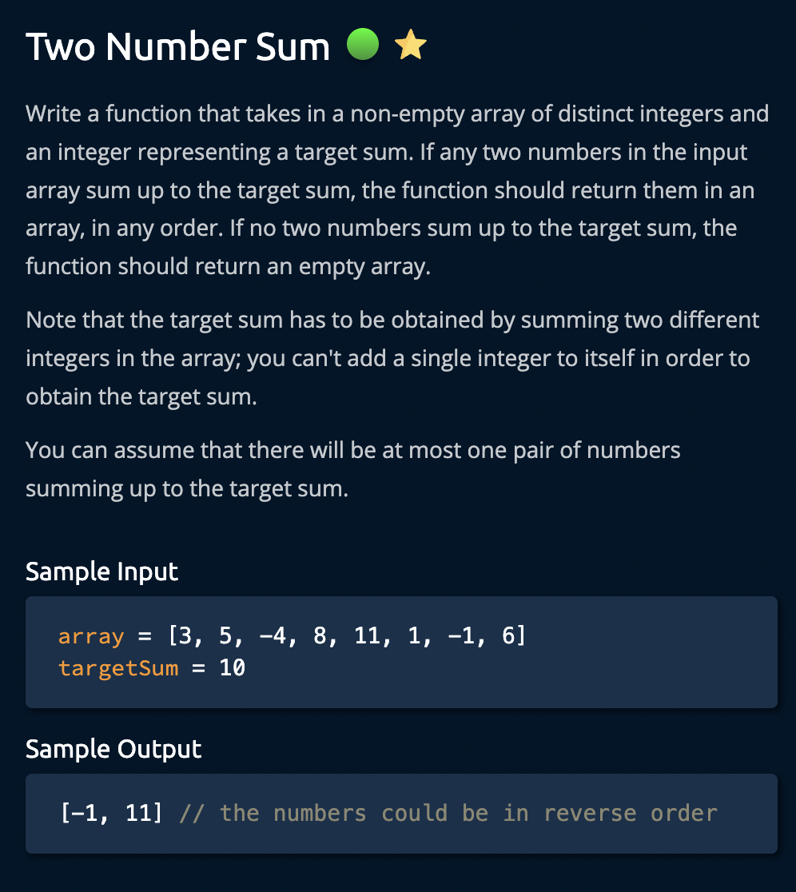
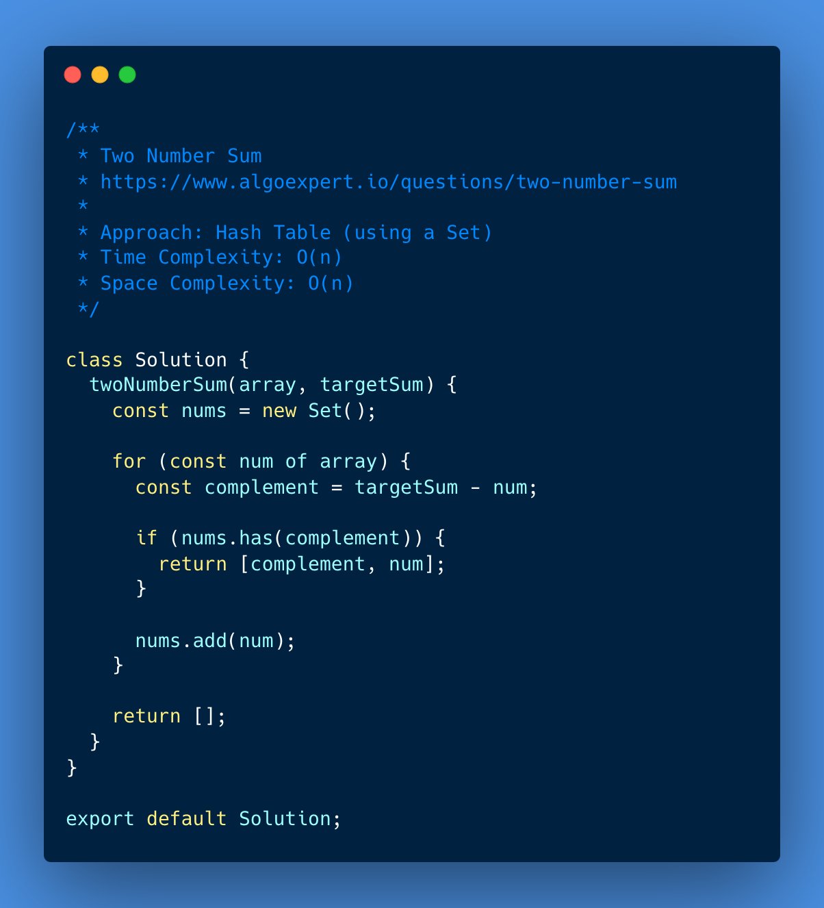

# Two Number Sum

<https://www.algoexpert.io/questions/two-number-sum>

- [Problem](#problem)
- [Solution](#solution)
  - [Brute Force](#brute-force)
  - [Hash Table (using an object)](#hash-table-using-an-object)
  - [Hash Table (using a set)](#hash-table-using-a-set)
  - [Sorting + Two Pointers](#sorting--two-pointers)
- [Test Results](#test-results)

## Problem

## Solution

### Brute Force

### Hash Table (using an object)

### Hash Table (using a set)

### Sorting + Two Pointers

## Test Results

