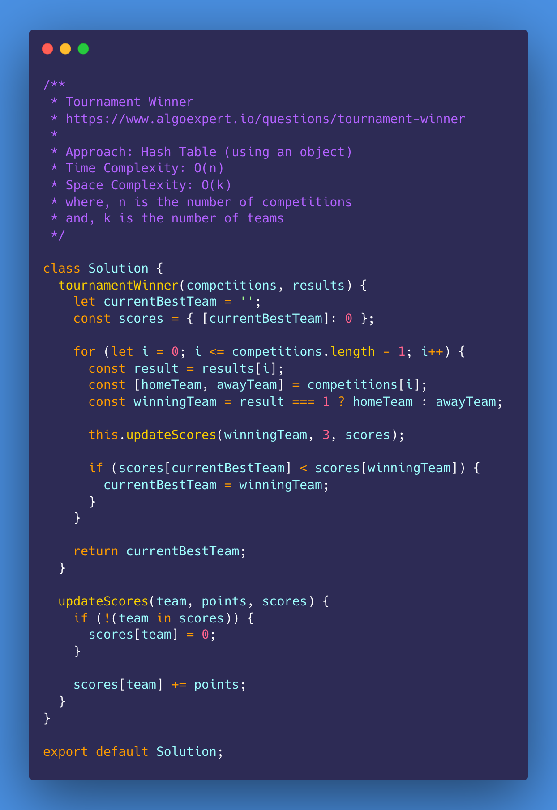
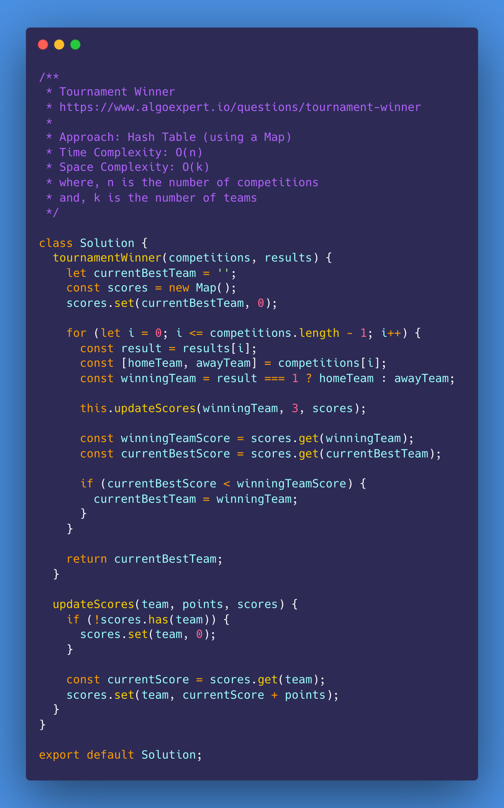

# Tournament Winner

<https://www.algoexpert.io/questions/tournament-winner>

- [Problem](#problem)
- [Solution](#solution)
  - [Hash Table (using an object)](#hash-table-using-an-object)
  - [Hash Table (using a Map)](#hash-table-using-a-map)
- [Test Results](#test-results)

## Problem

## Solution

### Hash Table (using an object)

### Hash Table (using a Map)

## Test Results

