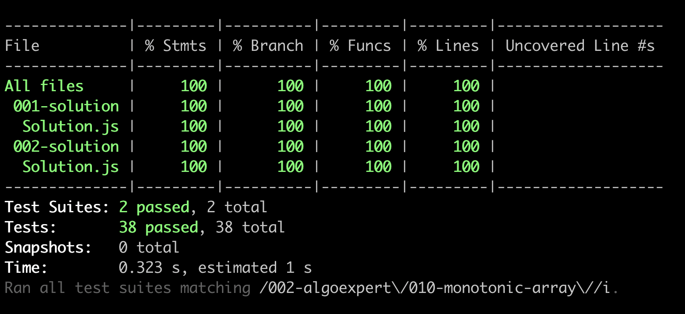

# Monotonic Array

<https://www.algoexpert.io/questions/monotonic-array>

- [Problem](#problem)
- [Solution](#solution)
- [Test Results](#test-results)

## Problem

## Solution

### Direction Tracking

### One Pass

## Test Results

