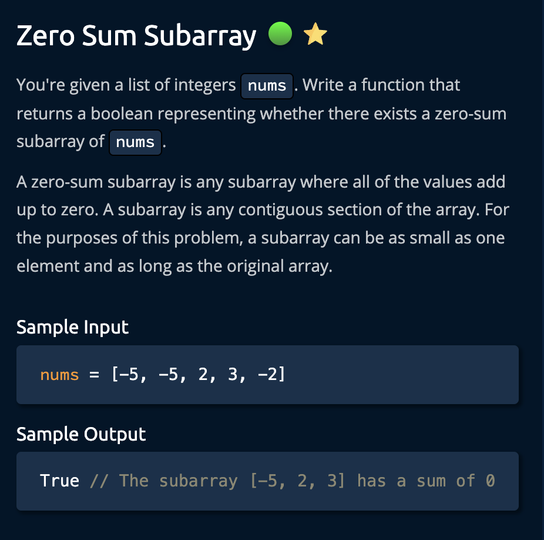
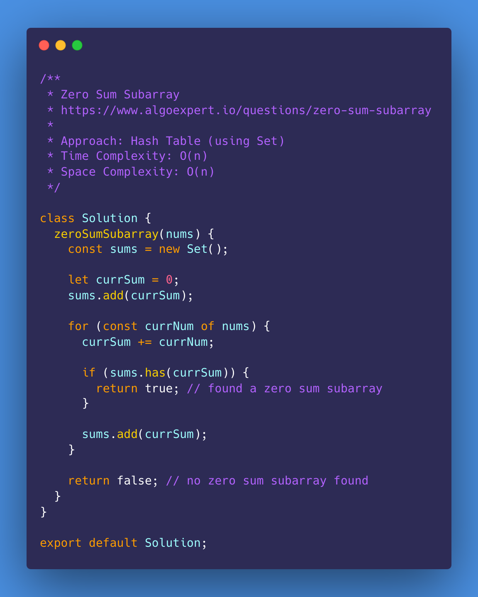
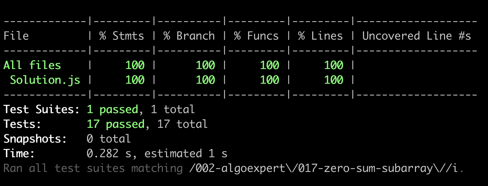

# Zero Sum Subarray

<https://www.algoexpert.io/questions/zero-sum-subarray>

- [Problem](#problem)
- [Solution](#solution)
  - [Hash Table (using Set)](#hash-table-using-set)
- [Test Results](#test-results)

## Problem

## Solution

### Hash Table (using Set)

## Test Results

