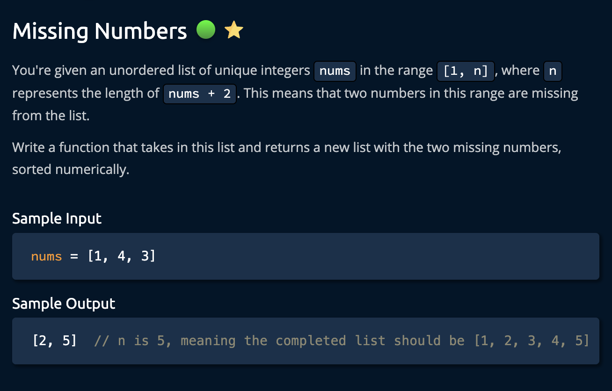
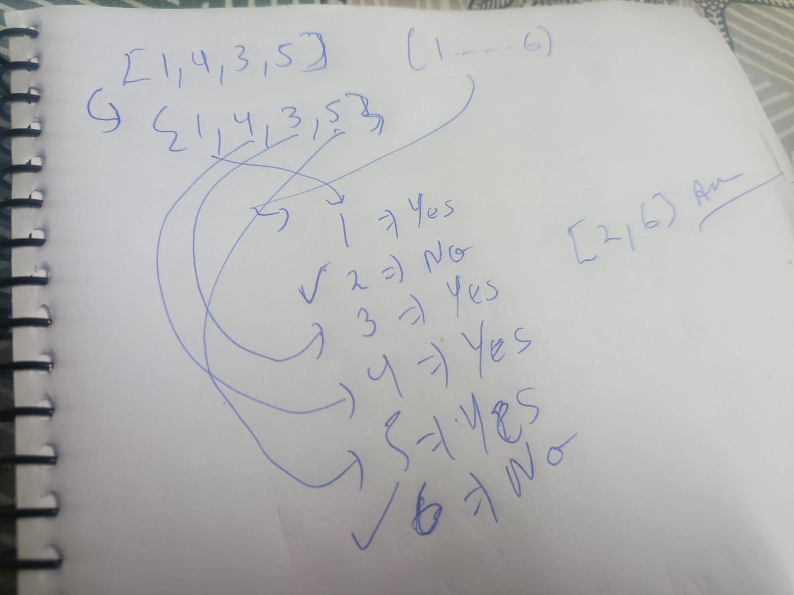
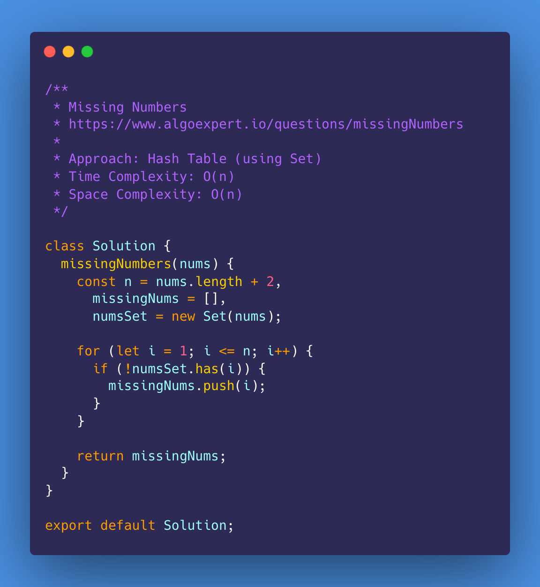
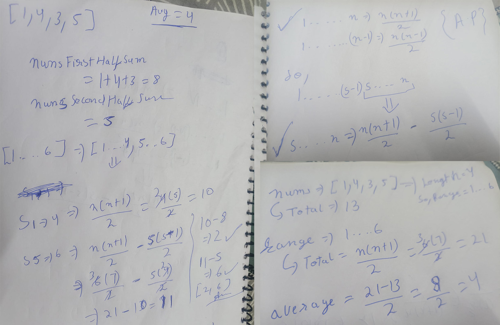
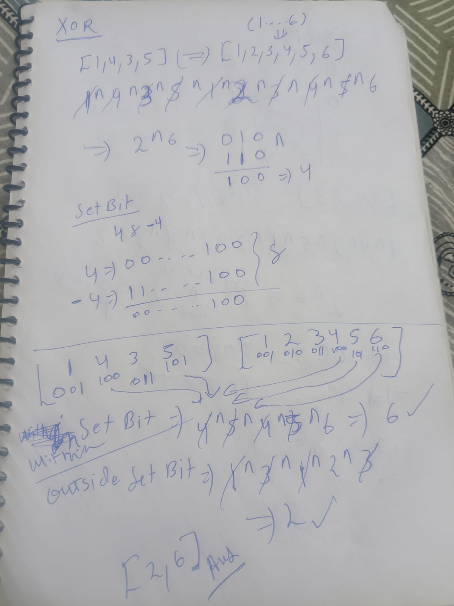
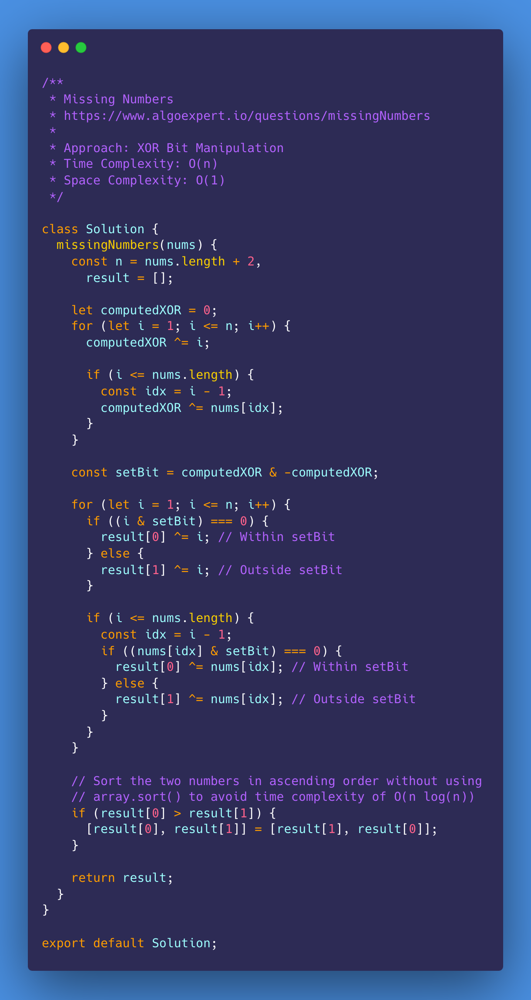
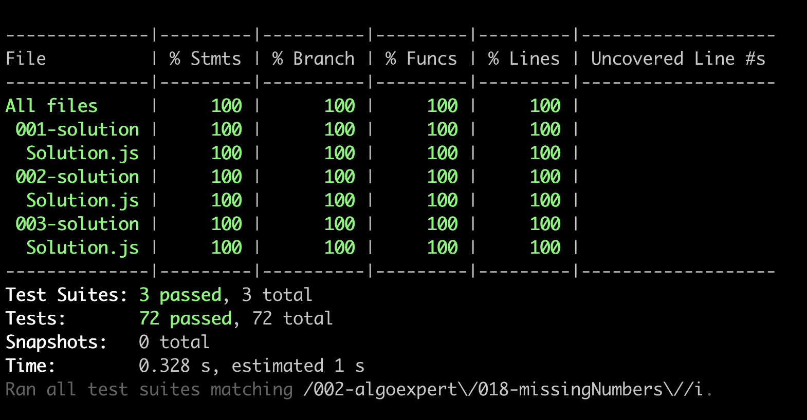

# Missing Numbers

<https://www.algoexpert.io/questions/missingNumbers>

- [Problem](#problem)
- [Solution](#solution)
  - [Hash Table (using Set)](#hash-table-using-set)
  - [Maths](#maths)
  - [XOR Bit Manipulation](#xor-bit-manipulation)
- [Test Results](#test-results)

## Problem

## Solution

### Hash Table (using Set)

### Maths

### XOR Bit Manipulation

## Test Results

