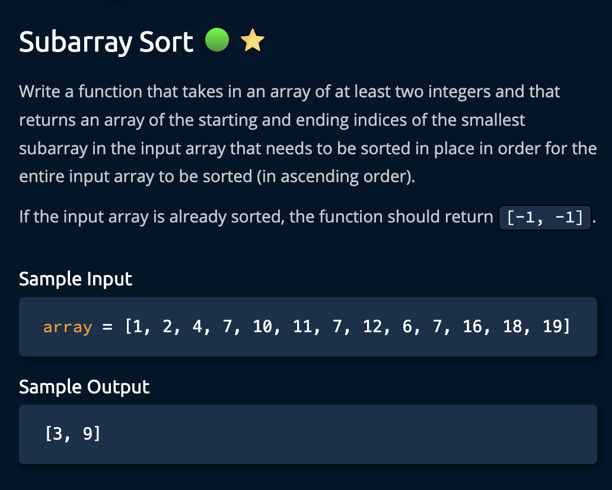
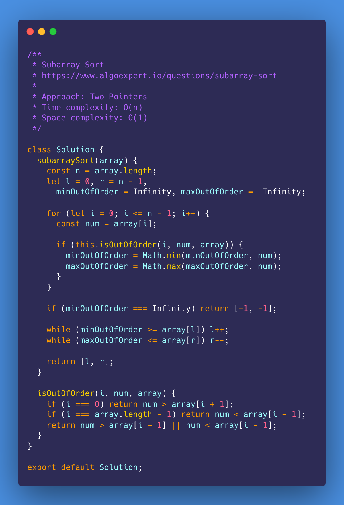
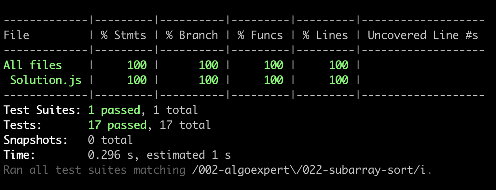

# Subarray Sort

<https://www.algoexpert.io/questions/subarray-sort>

- [Problem](#problem)
- [Solution](#solution)
  - [Two Pointers](#two-pointers)
- [Test Results](#test-results)

## Problem

## Solution

### Two Pointers

## Test Results

