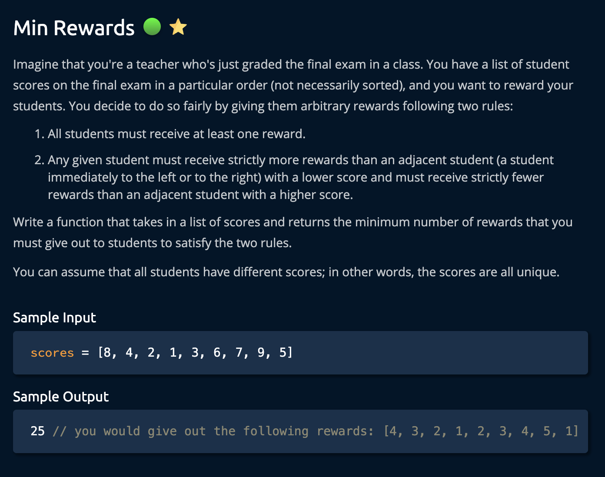
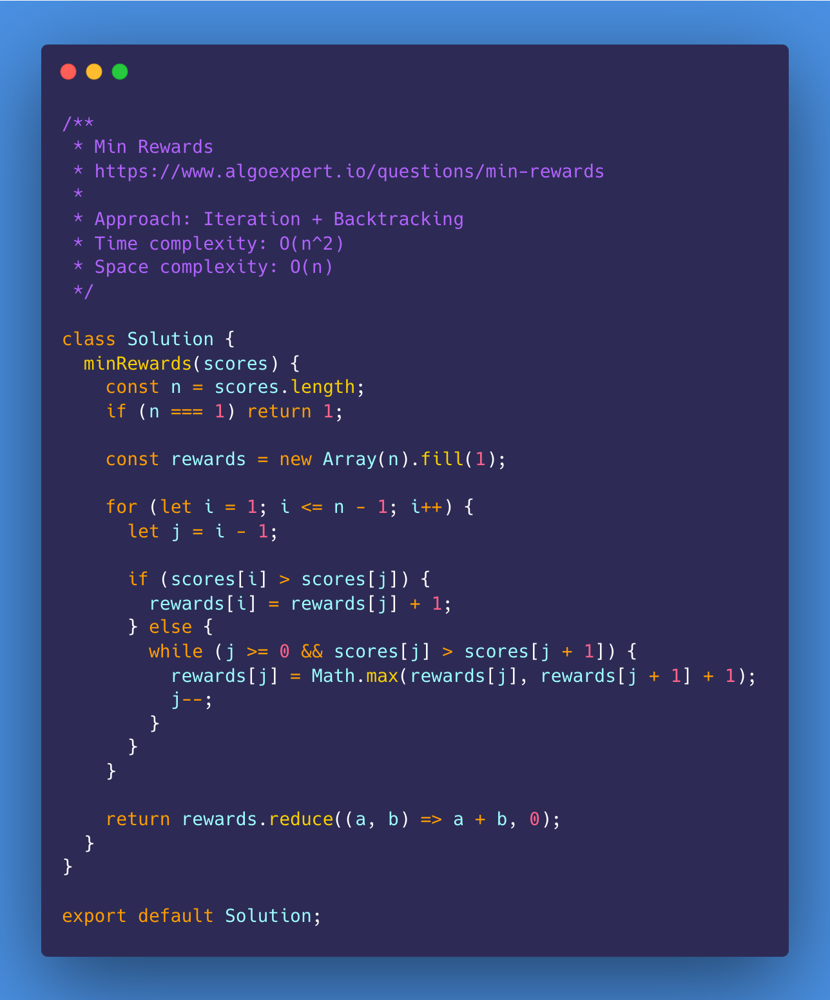
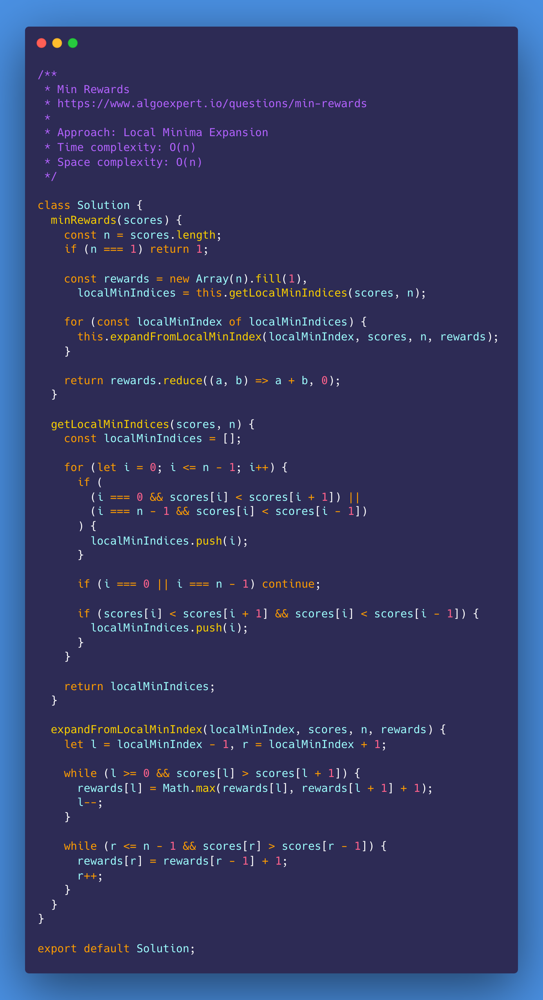
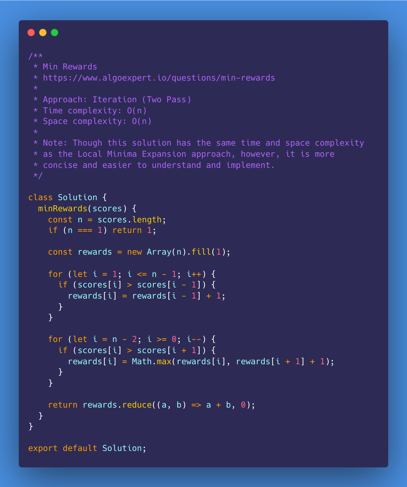

# Min Rewards

<https://www.algoexpert.io/questions/min-rewards>

- [Problem](#problem)
- [Solution](#solution)
  - [Iteration + Backtracking](#iteration--backtracking)
  - [Local Minima Expansion](#local-minima-expansion)
  - [Iteration (Two Pass)](#iteration-two-pass)
- [Test Results](#test-results)

## Problem

## Solution

### Iteration + Backtracking

### Local Minima Expansion

### Iteration (Two Pass)

## Test Results

