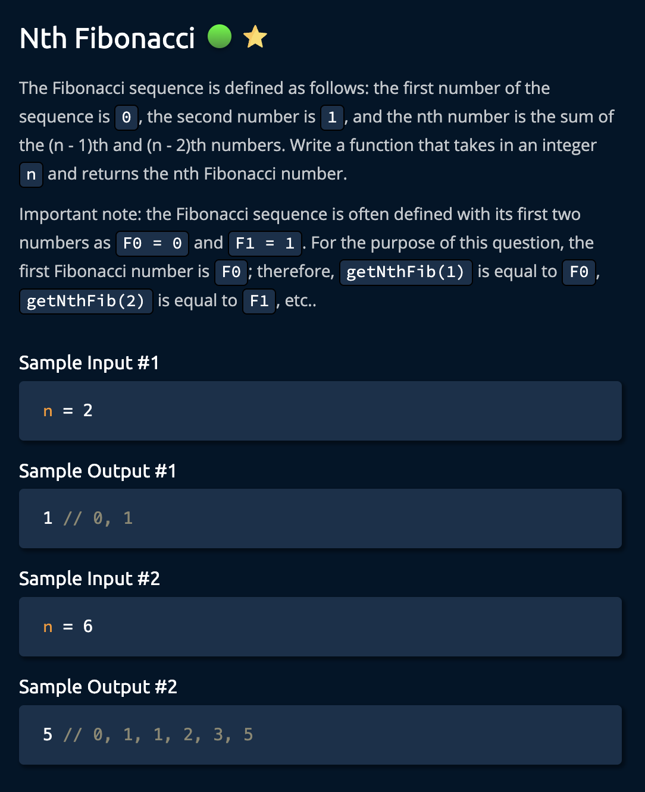
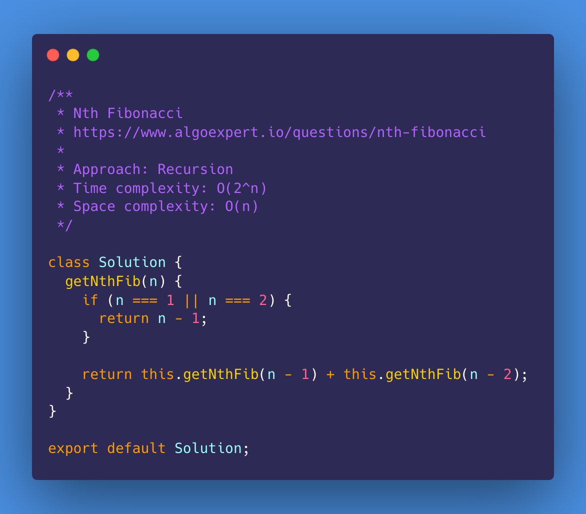
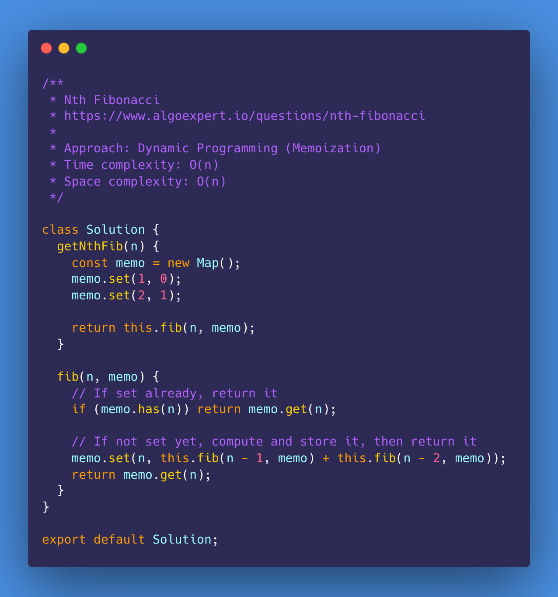
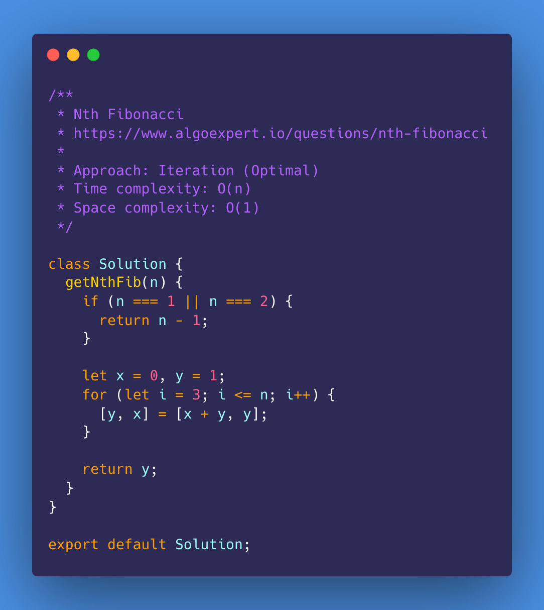
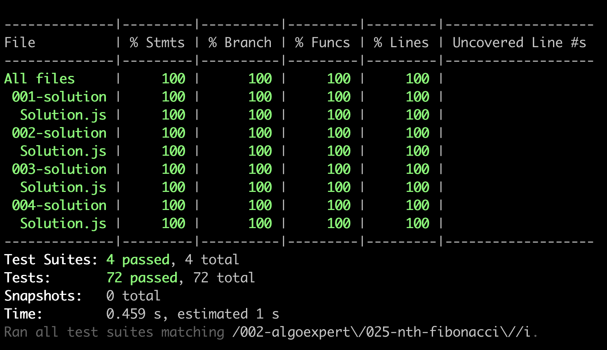

# Nth Fibonacci

<https://www.algoexpert.io/questions/nth-fibonacci>

- [Problem](#problem)
- [Solution](#solution)
  - [Recursion](#recursion)
  - [Dynamic Programming (Memoization)](#dynamic-programming-memoization)
  - [Dynamic Programming (Tabulation)](#dynamic-programming-tabulation)
  - [Iteration (Optimial)](#iteration-optimial)
- [Test Results](#test-results)

## Problem

## Solution

### Recursion

### Dynamic Programming (Memoization)

### Dynamic Programming (Tabulation)

### Iteration (Optimial)

## Test Results

