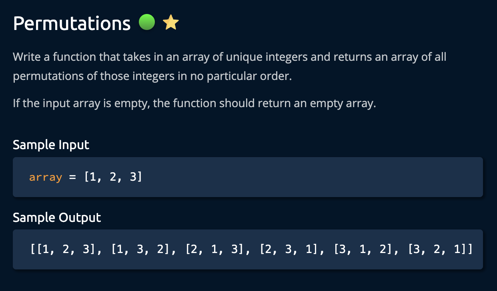
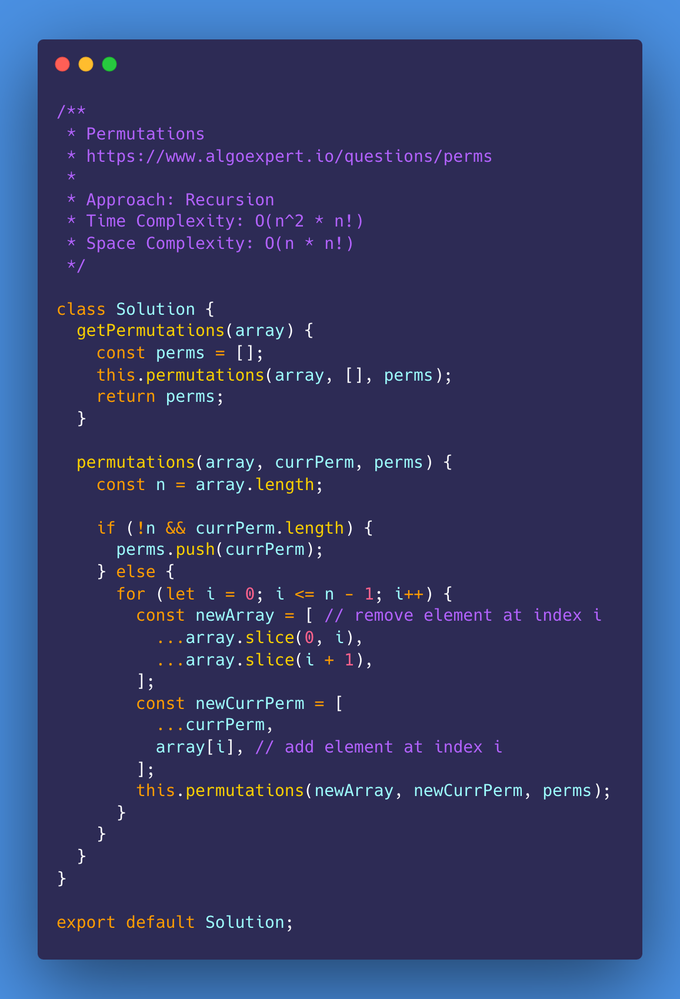
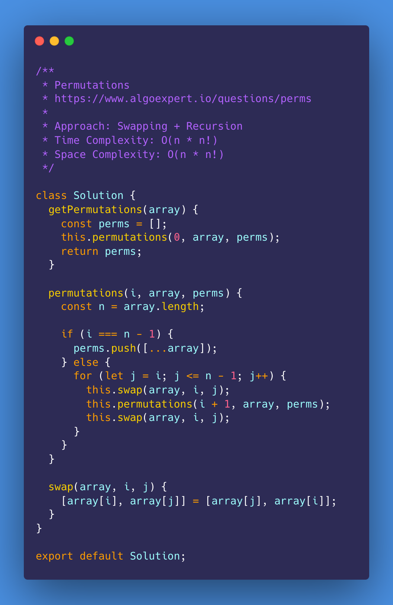
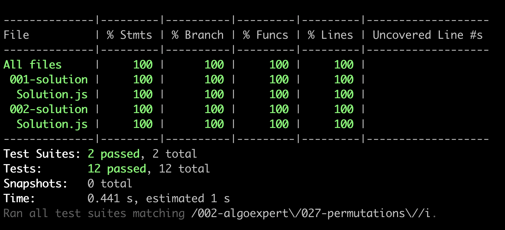

# Permutations

<https://www.algoexpert.io/questions/permutations>

- [Problem](#problem)
- [Solution](#solution)
  - [Recursion](#recursion)
- [Test Results](#test-results)

## Problem

## Solution

### Recursion

### Swapping + Recursion

## Test Results

