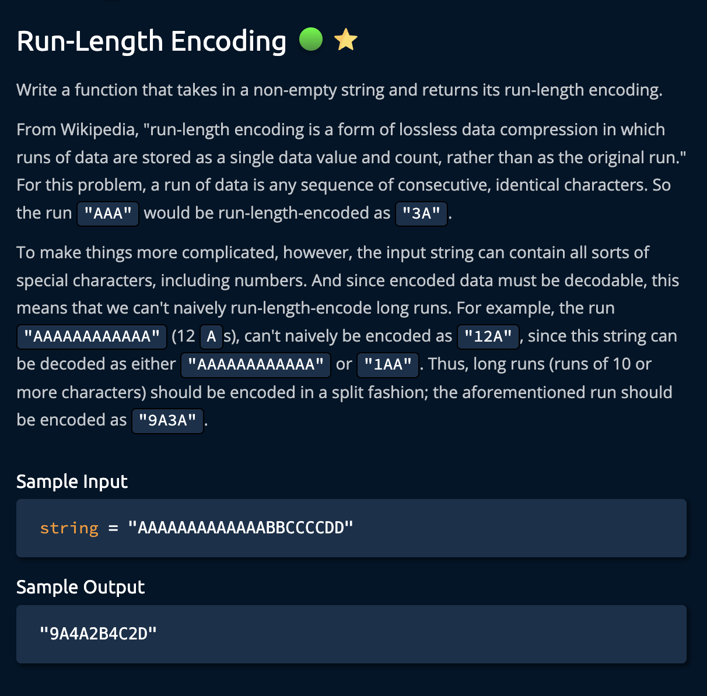
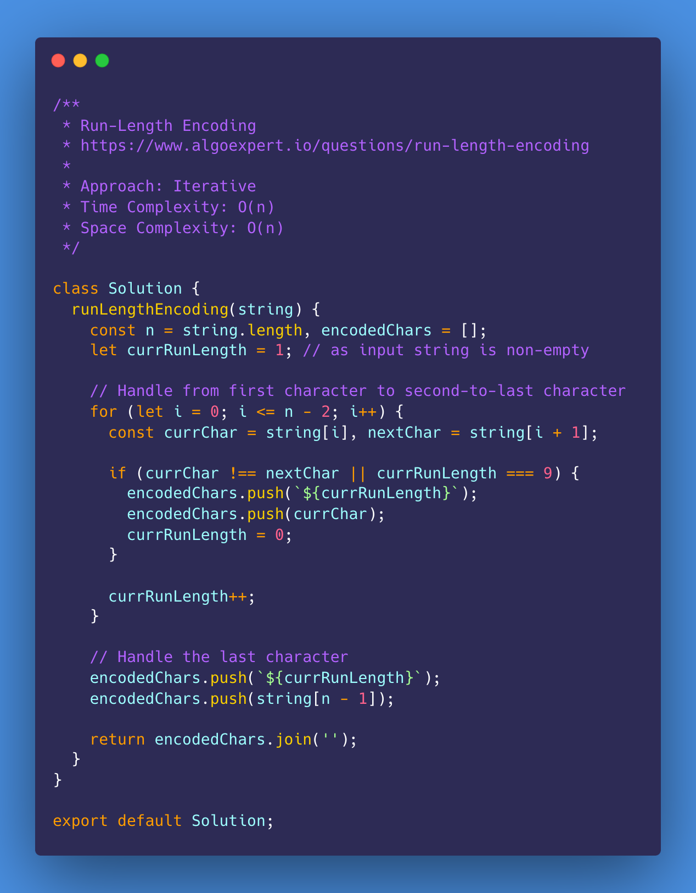
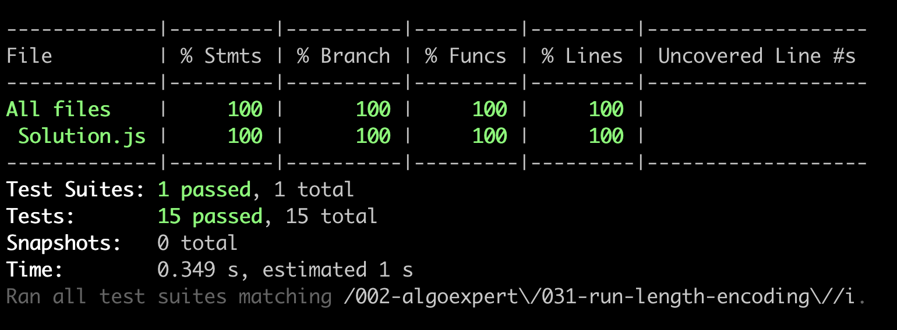

# Run-Length Encoding

<https://www.algoexpert.io/questions/caesar-cipher-encryptor>

- [Problem](#problem)
- [Solution](#solution)
  - [Iterative](#iterative)
- [Test Results](#test-results)

## Problem

## Solution

### Iterative

## Test Results

