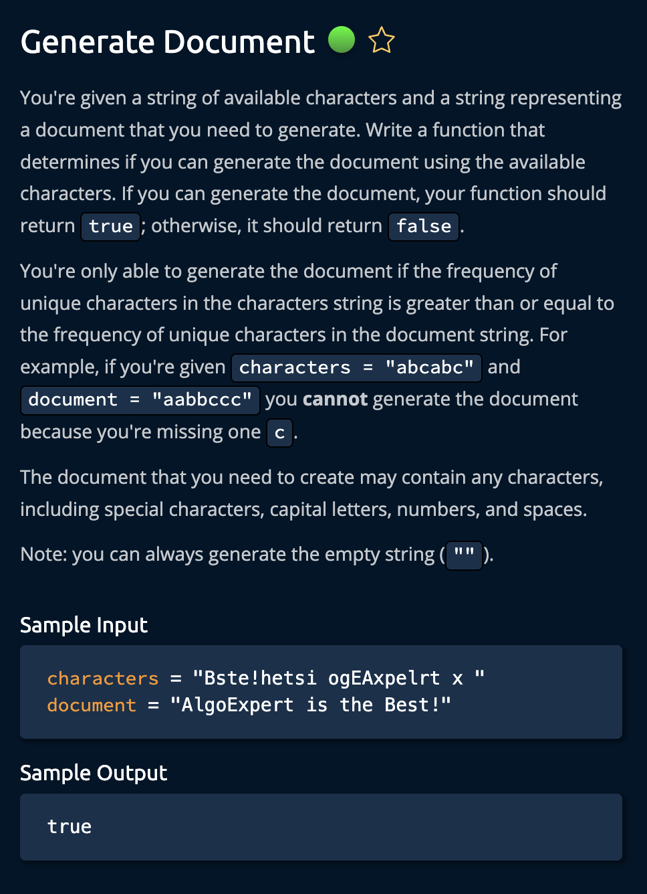
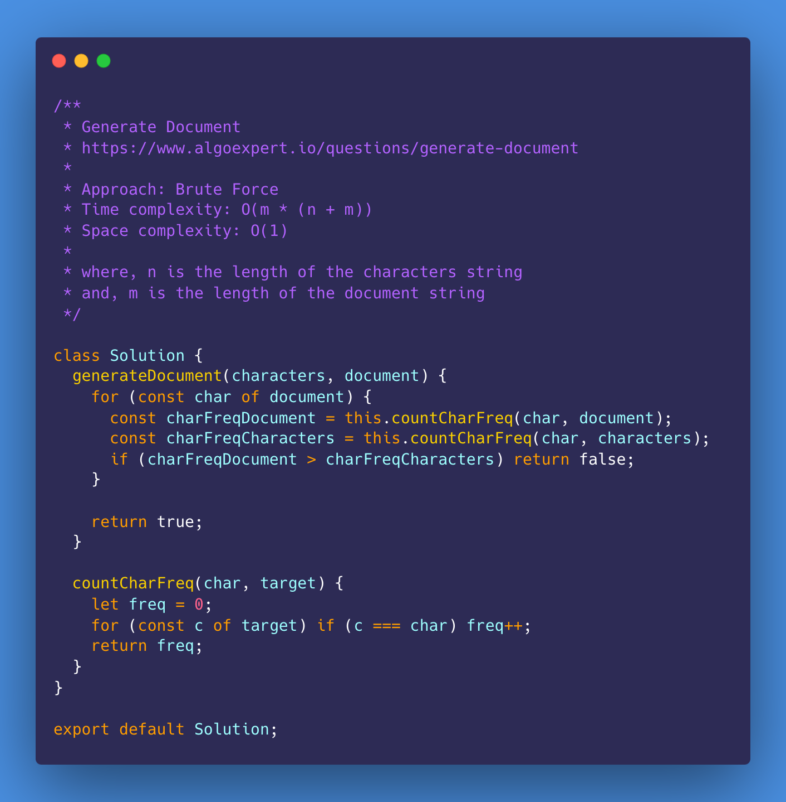
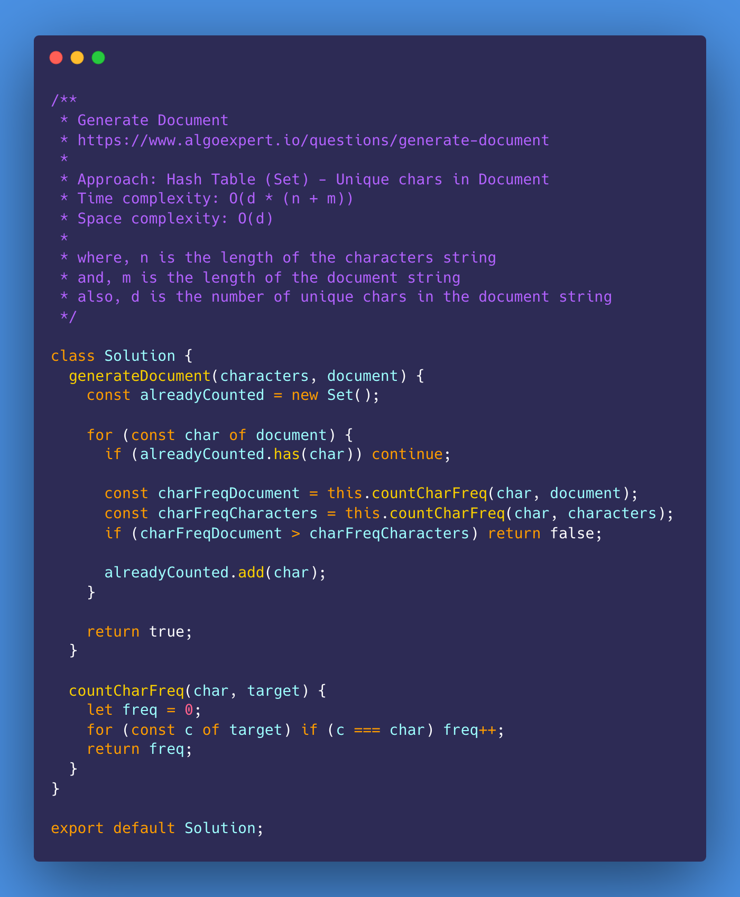
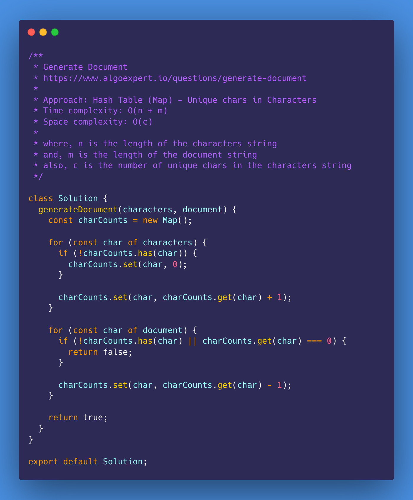
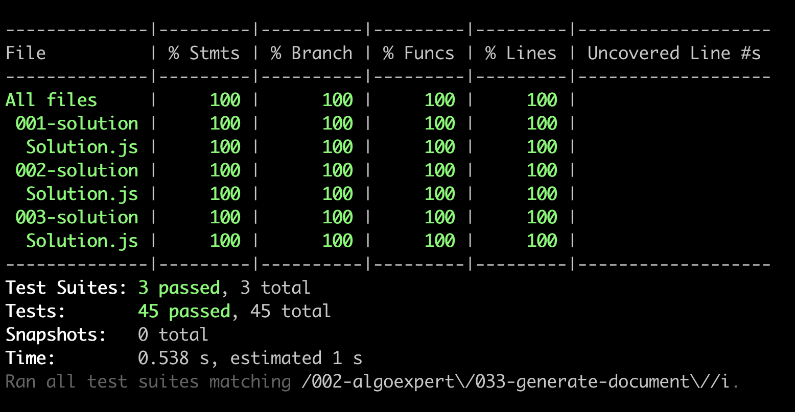

# Generate Document

<https://www.algoexpert.io/questions/generate-document>

- [Problem](#problem)
- [Solution](#solution)
  - [Brute Force](#brute-force)
  - [Hash Table (Set) - Unique chars in Document](#hash-table-set---unique-chars-in-document)
  - [Hash Table (Map) - Unique chars in Characters](#hash-table-map---unique-chars-in-characters)
- [Test Results](#test-results)

## Problem

## Solution

### Brute Force

### Hash Table (Set) - Unique chars in Document

### Hash Table (Map) - Unique chars in Characters

## Test Results

