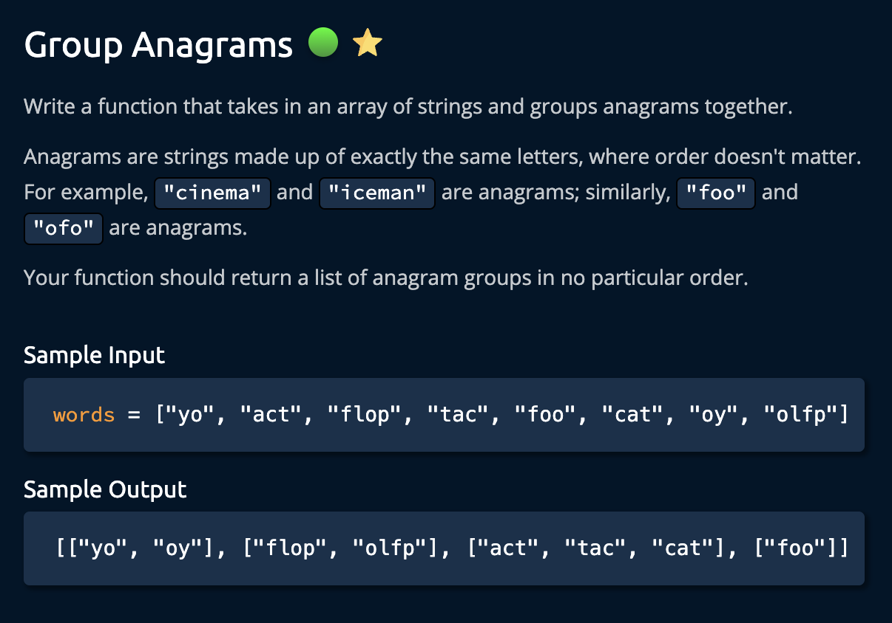

# Group Anagrams

<https://www.algoexpert.io/questions/group-anagrams>

- [Problem](#problem)
- [Solution](#solution)
  - [Hash Table (using object)](#hash-table-using-object)
- [Test Results](#test-results)

## Problem

## Solution

### Hash Table (using object)

## Test Results

