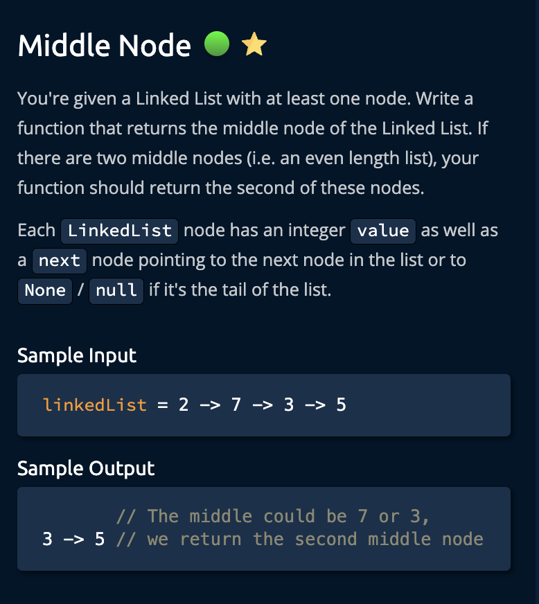
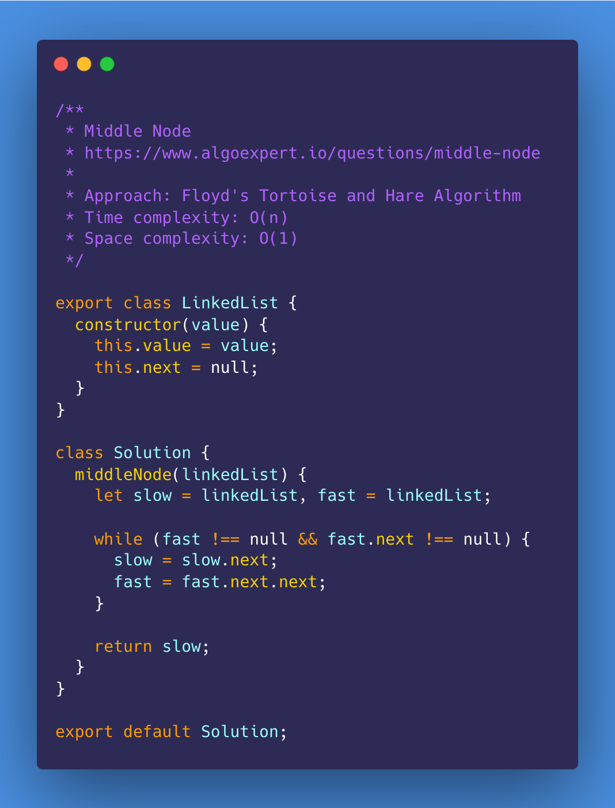
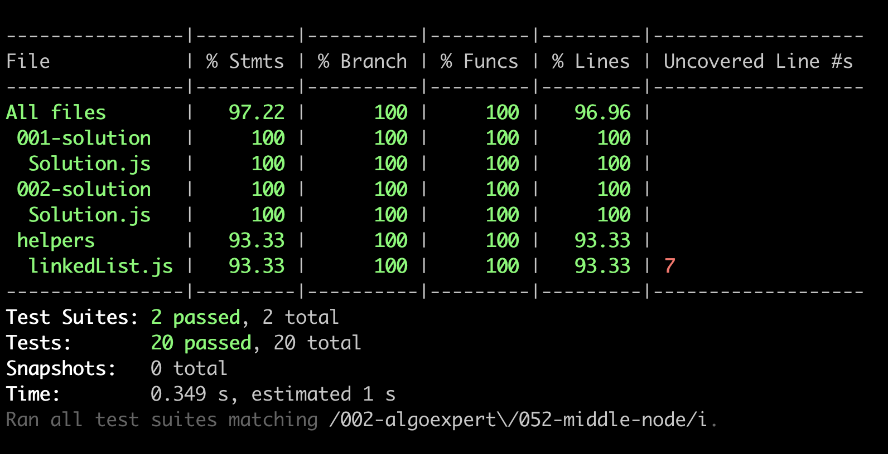

# Middle Node

<https://www.algoexpert.io/questions/middle-node>

- [Problem](#problem)
- [Solution](#solution)
  - [Counting Nodes](#counting-nodes)
  - [Floyd's Tortoise and Hare Algorithm](#floyds-tortoise-and-hare-algorithm)
- [Test Results](#test-results)

## Problem

## Solution

### Counting Nodes

### Floyd's Tortoise and Hare Algorithm

## Test Results

