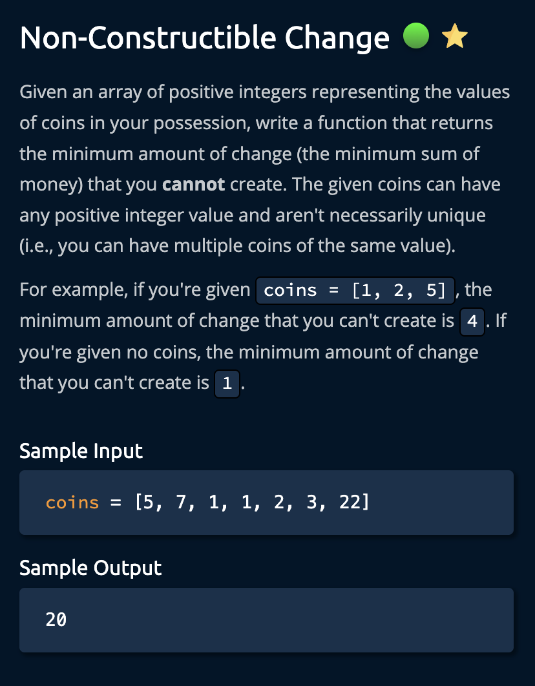
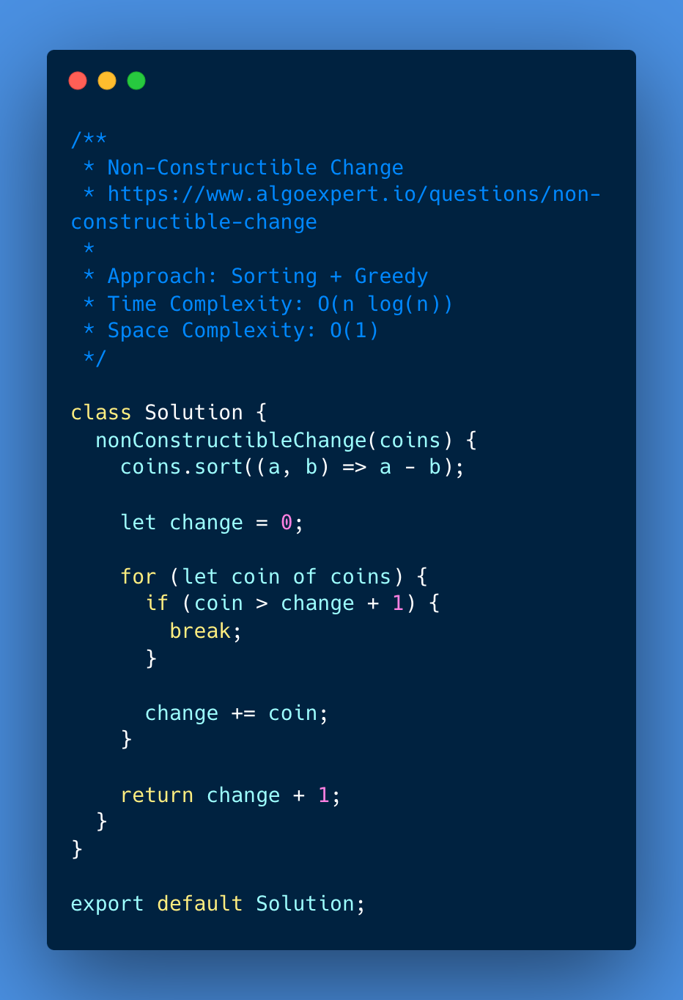
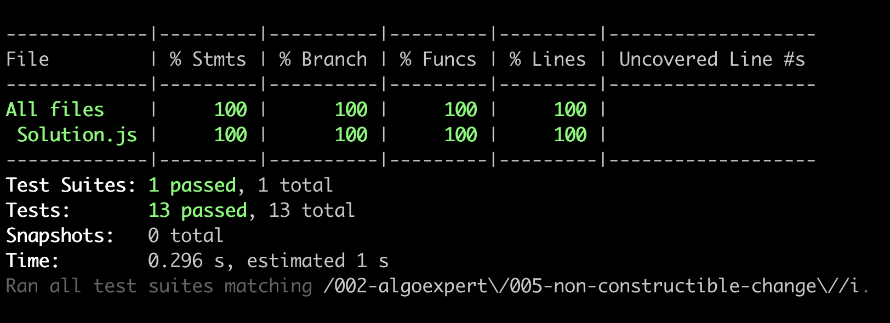

# Non-Constructible Change

<https://www.algoexpert.io/questions/non-constructible-change>

- [Problem](#problem)
- [Solution](#solution)
  - [Sorting + Greedy](#sorting--greedy)
- [Test Results](#test-results)

## Problem

## Solution

### Sorting + Greedy

## Test Results

