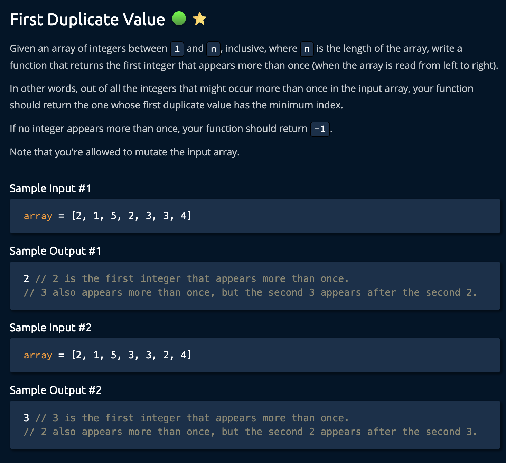
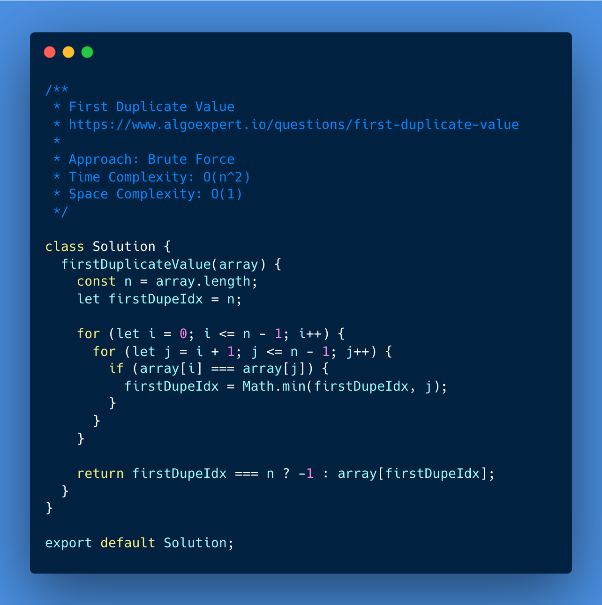
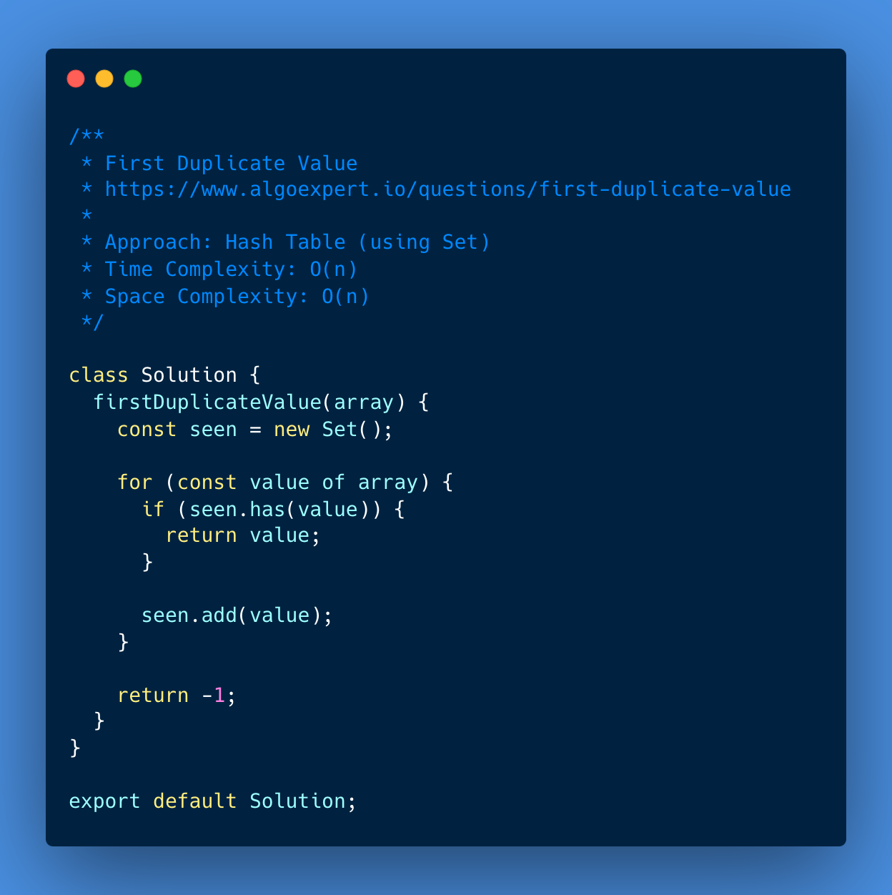
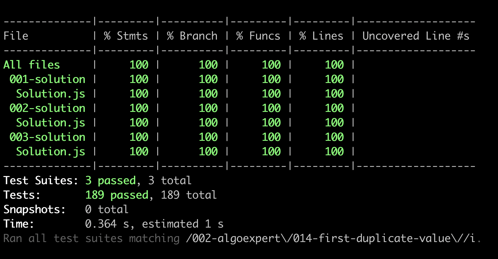

# First Duplicate Value

<https://www.algoexpert.io/questions/first-duplicate-value>

- [Problem](#problem)
- [Solution](#solution)
  - [Brute Force](#brute-force)
  - [Hash Table (using Set)](#hash-table-using-set)
  - [Absolute Value + Negation](#absolute-value--negation)
- [Test Results](#test-results)

## Problem

## Solution

### Brute Force

### Hash Table (using Set)

### Absolute Value + Negation

## Test Results

