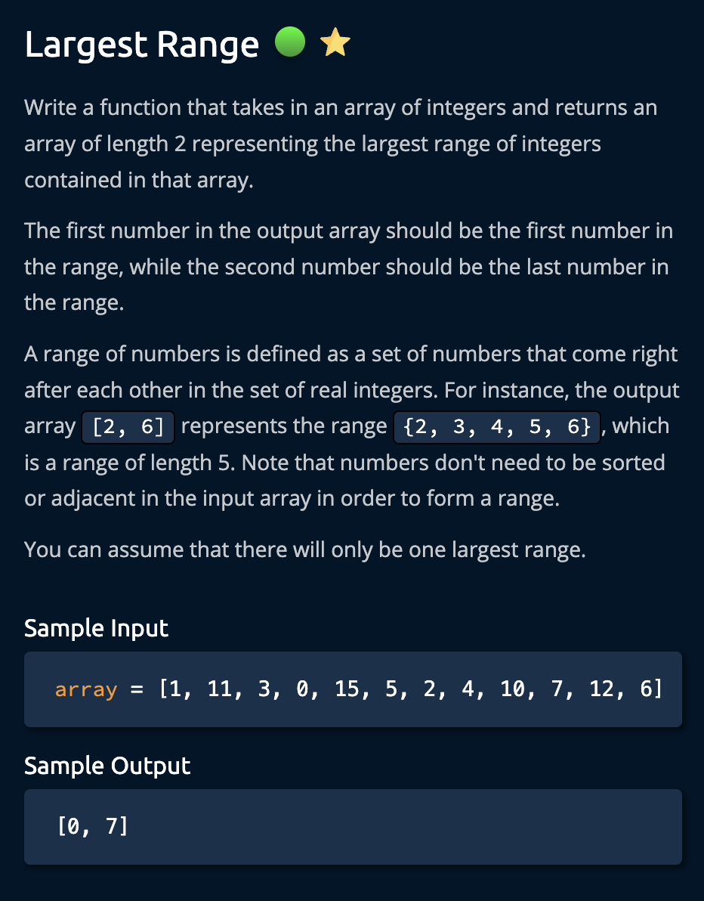
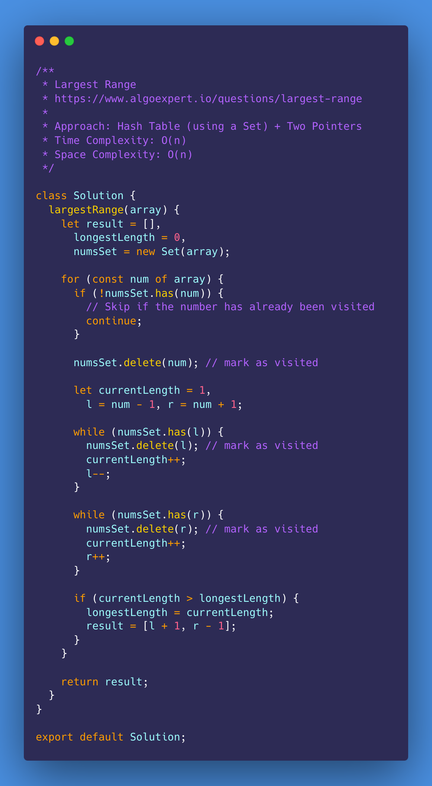
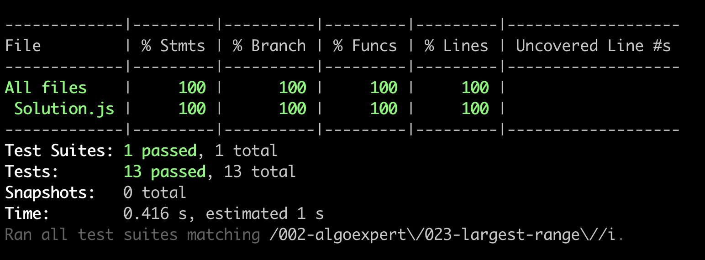

# Largest Range

<https://www.algoexpert.io/questions/largest-range>

- [Problem](#problem)
- [Solution](#solution)
  - [Hash Table (using a Set + Two Pointers](#hash-table-using-a-set--two-pointers)
- [Test Results](#test-results)

## Problem

## Solution

### Hash Table (using a Set) + Two Pointers

## Test Results

