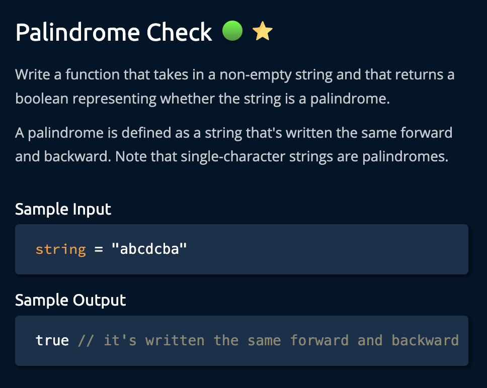
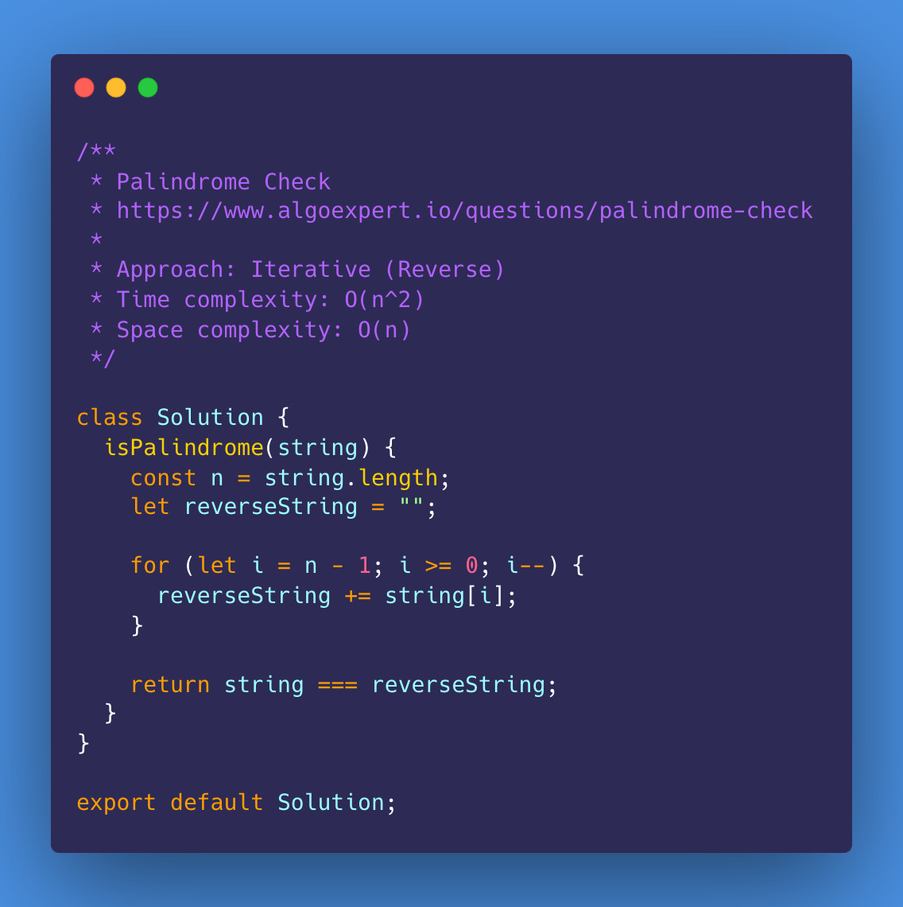
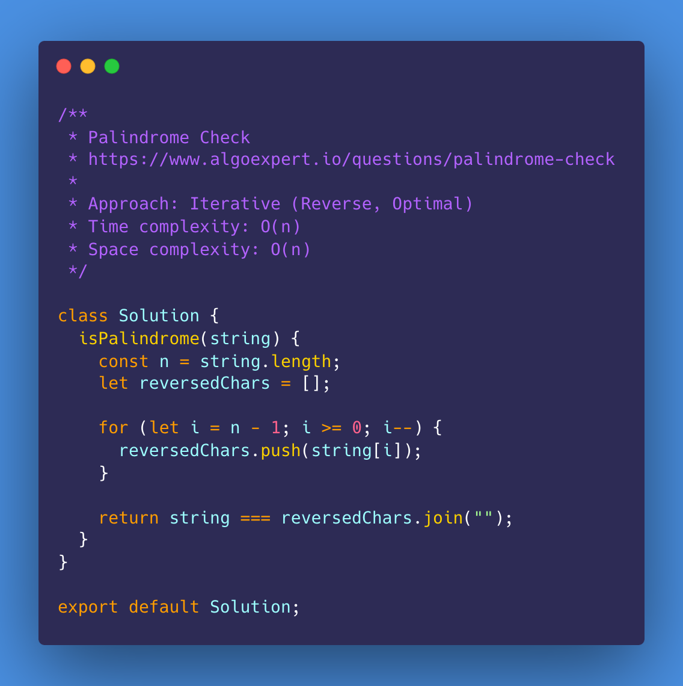
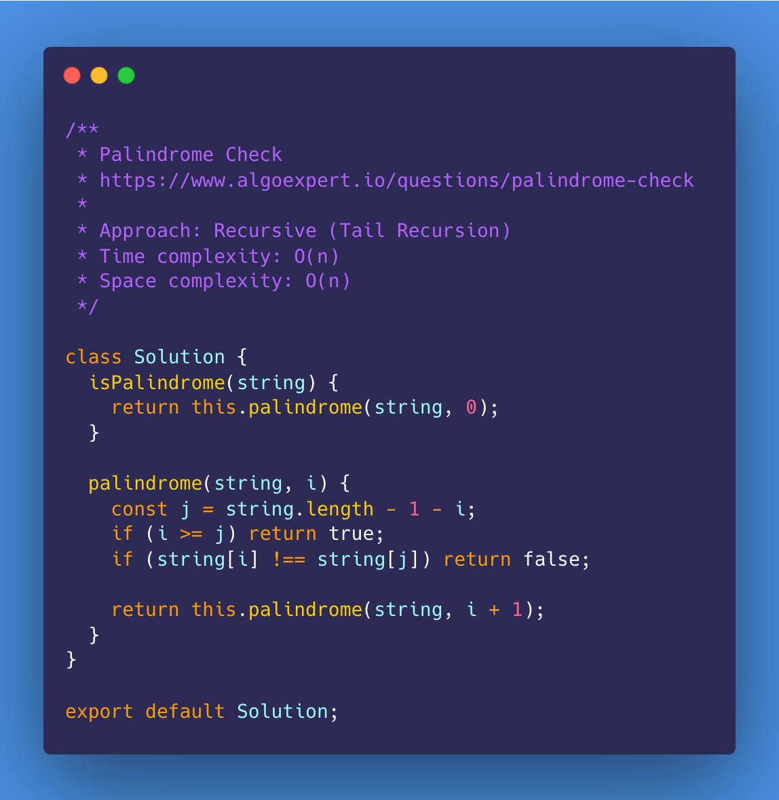
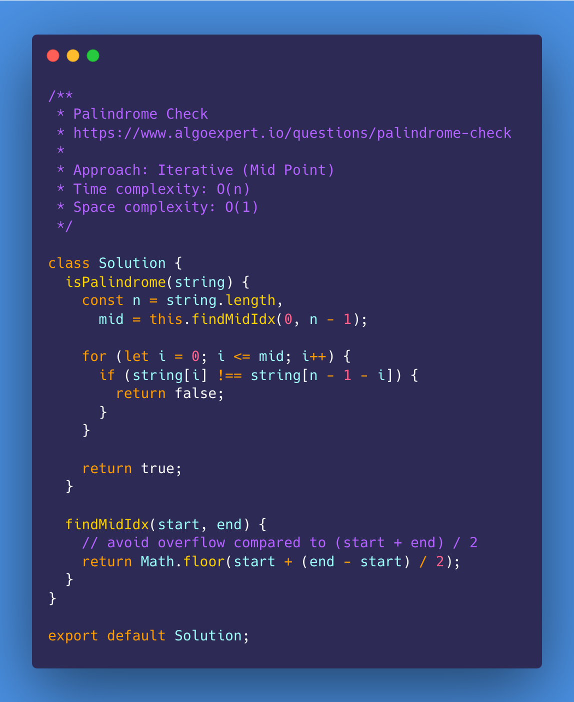
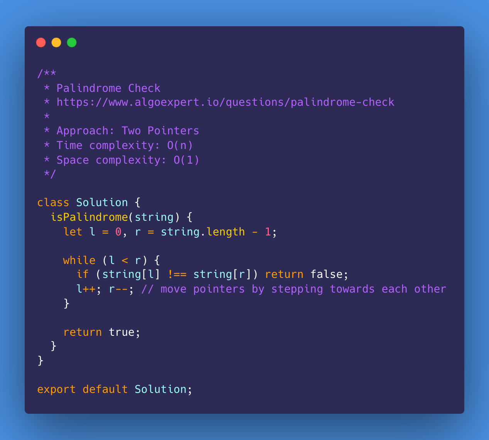
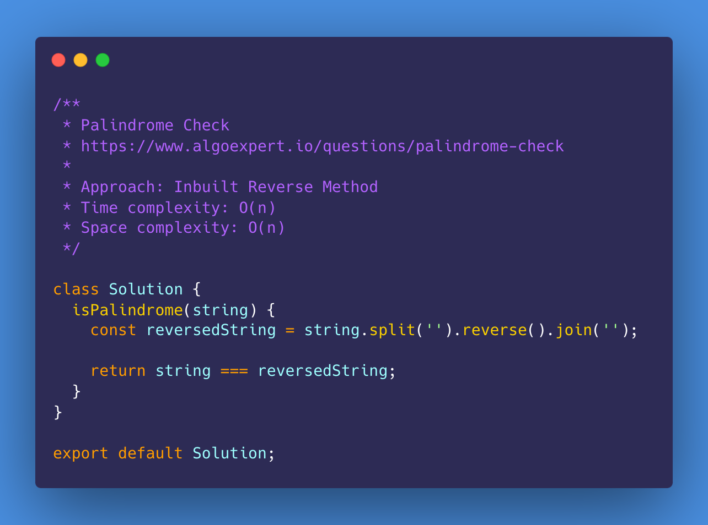
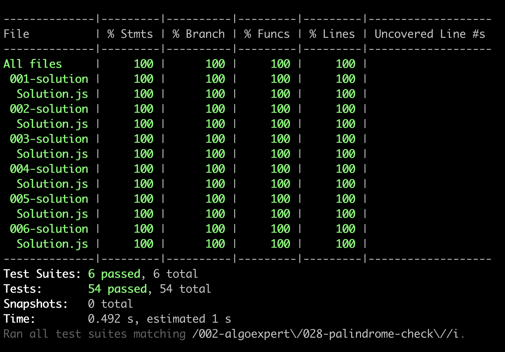

# Palindrome Check

<https://www.algoexpert.io/questions/palindrome-check>

- [Problem](#problem)
- [Solution](#solution)
  - [Iterative (Reverse)](#iterative-reverse)
  - [Iterative (Reverse, Optimal)](#iterative-reverse-optimal)
  - [Recursive (Tail Recursion)](#recursive-tail-recursion)
  - [Iterative (Mid Point)](#iterative-mid-point)
  - [Two Pointers](#two-pointers)
- [Test Results](#test-results)

## Problem

## Solution

### Iterative (Reverse)

### Iterative (Reverse, Optimal)

### Recursive (Tail Recursion)

### Iterative (Mid Point)

### Two Pointers

## Extra Solution (Inbuilt Methods)

### Inbuilt Reverse Method

## Test Results

