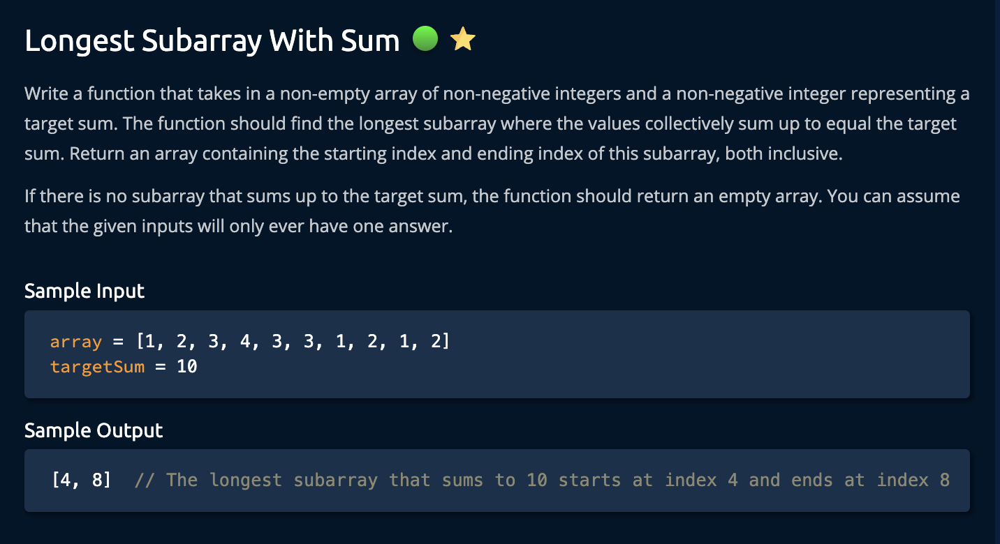
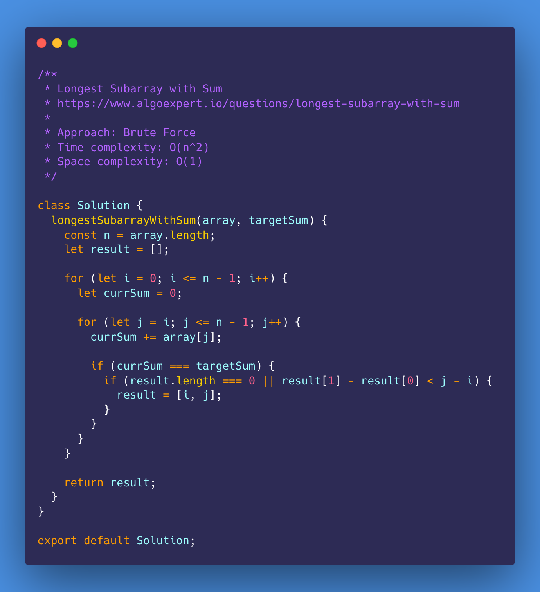
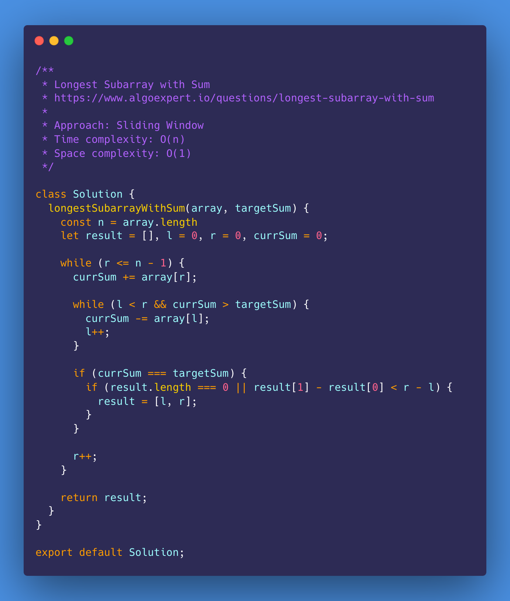
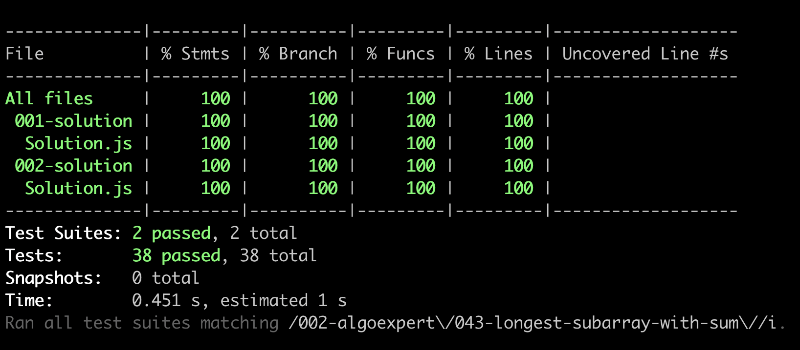

# Longest Subarray with Sum

<https://www.algoexpert.io/questions/longest-subarray-with-sum>

- [Problem](#problem)
- [Solution](#solution)
  - [Brute Force](#brute-force)
  - [Sliding Window](#sliding-window)
- [Test Results](#test-results)

## Problem

## Solution

### Brute Force

### Sliding Window

## Test Results

