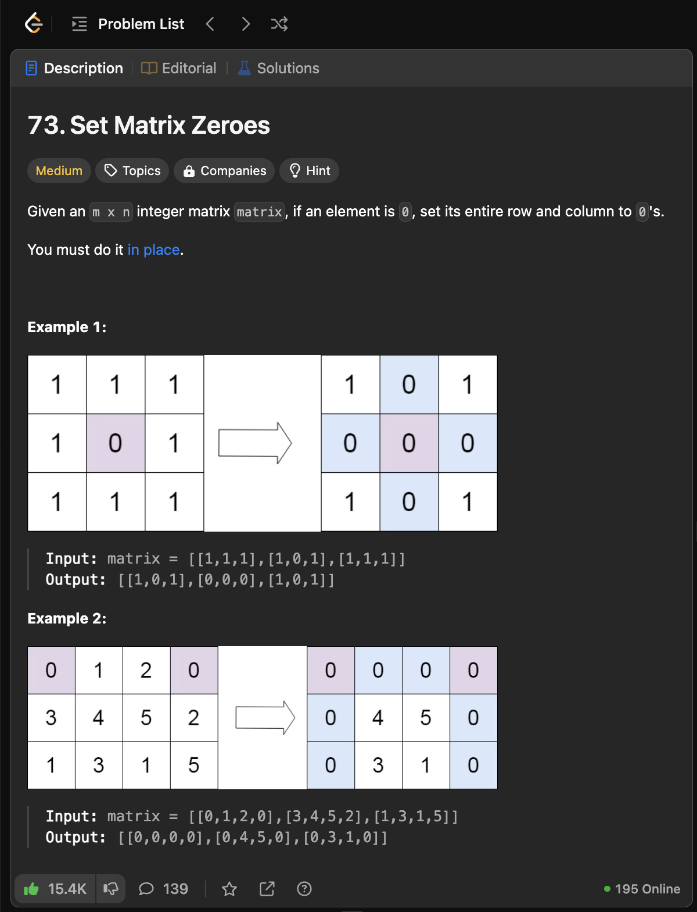
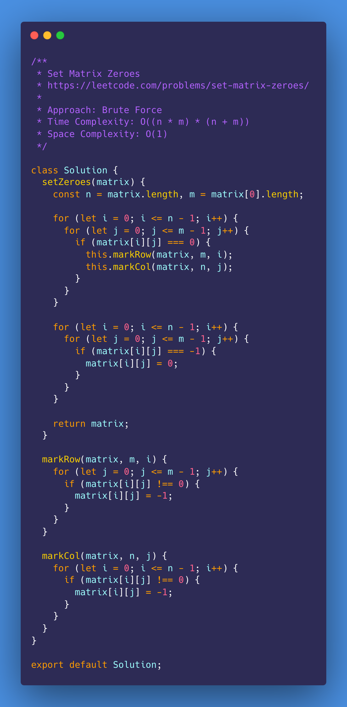
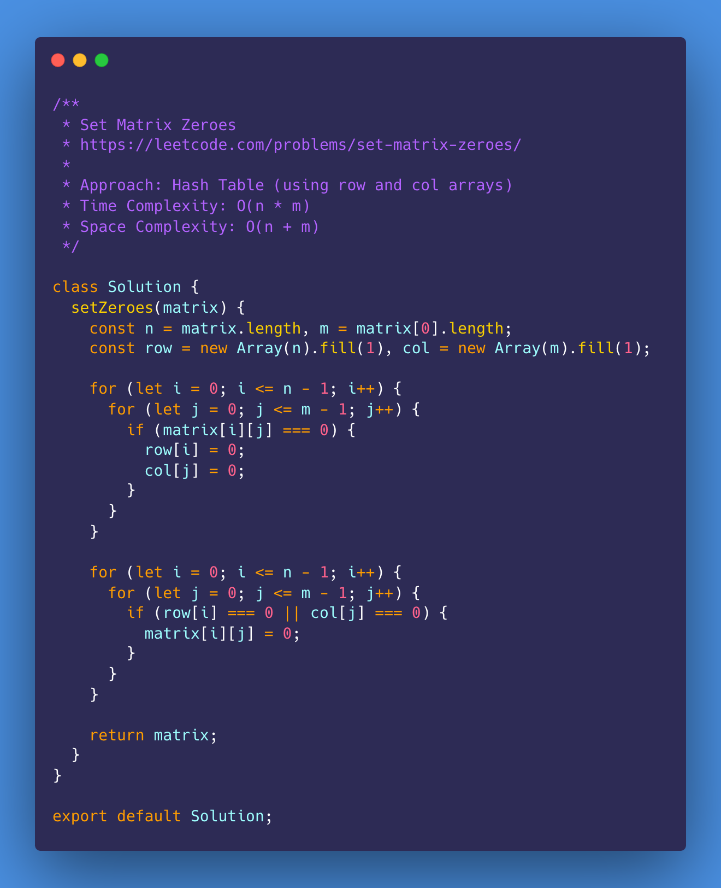
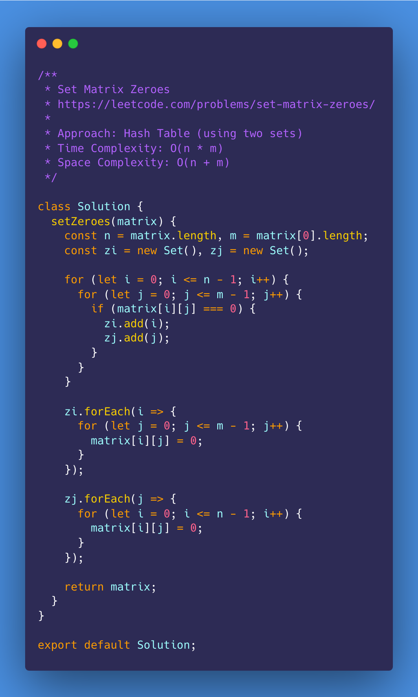
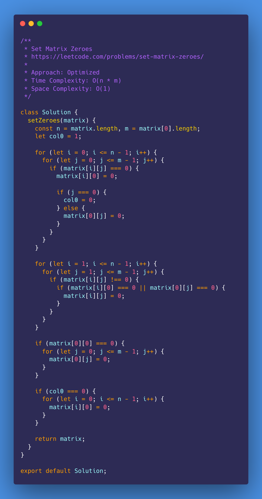
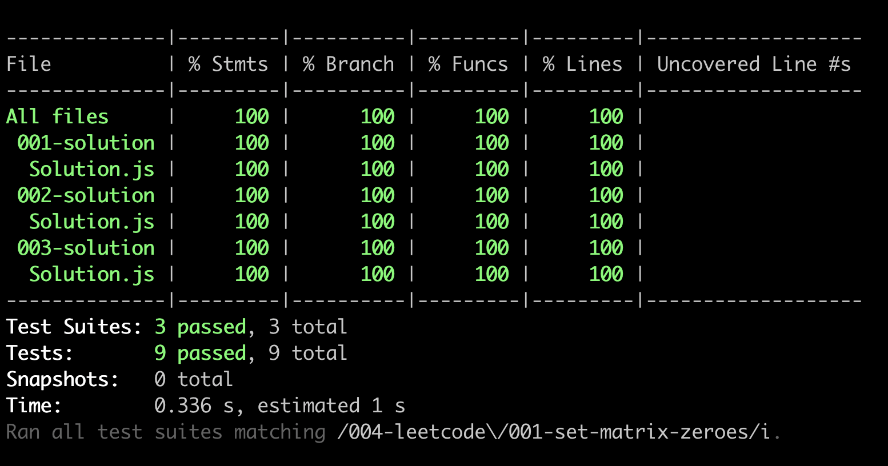

# Set Matrix Zeroes

<https://leetcode.com/problems/set-matrix-zeroes/description/>

- [Problem](#problem)
- [Solution](#solution)
  - [Brute Force](#brute-force)
  - [Hash Table (using row and col arrays)](#hash-table-using-row-and-col-arrays)
  - [Constant Space](#constant-space)
- [Test Results](#test-results)

## Problem

## Solution

### Brute Force

### Hash Table (using row and col arrays)

### Hash Table (using two sets)

### Constant Space

## Test Results

