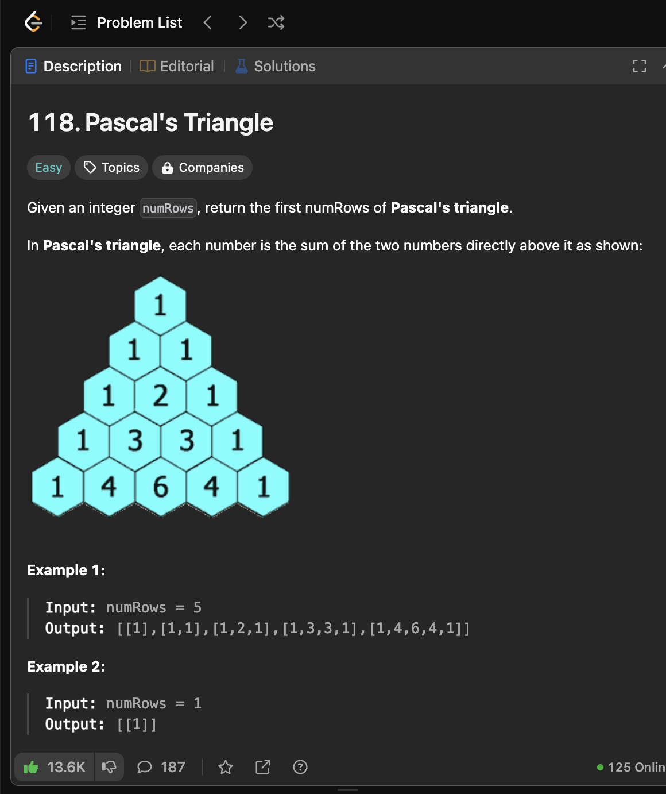
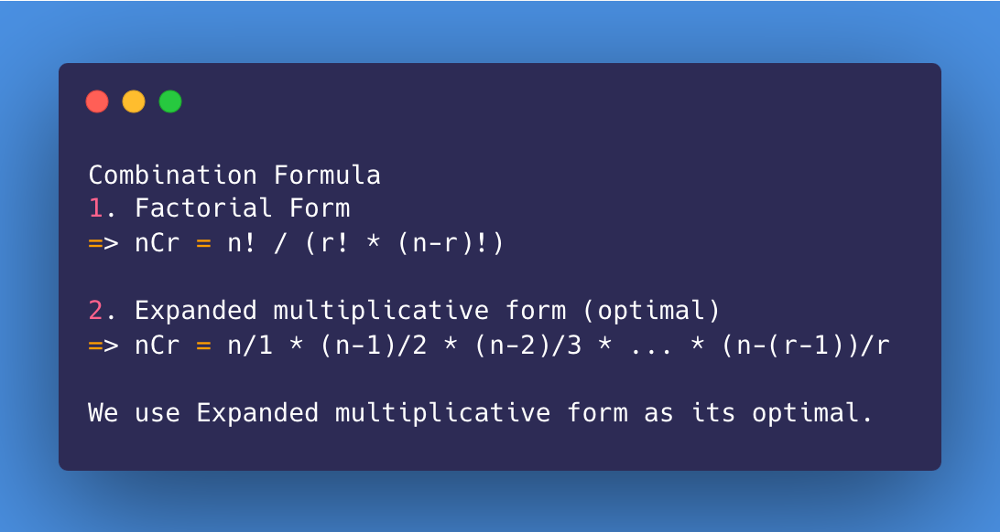
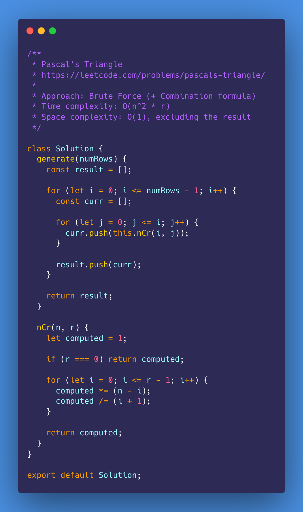
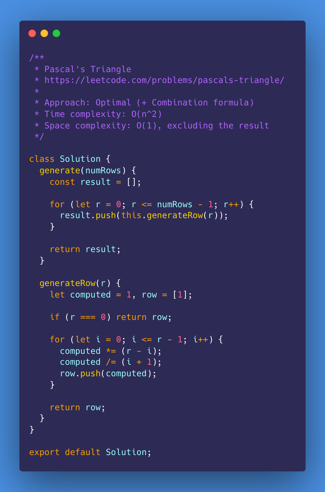
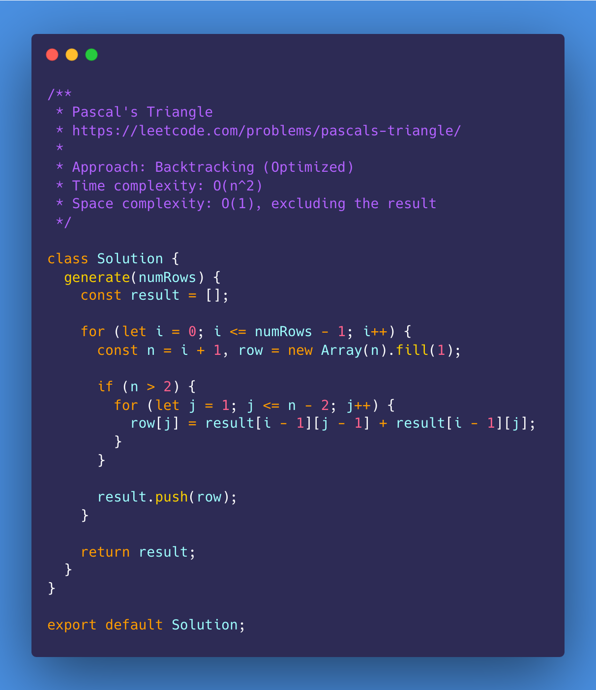
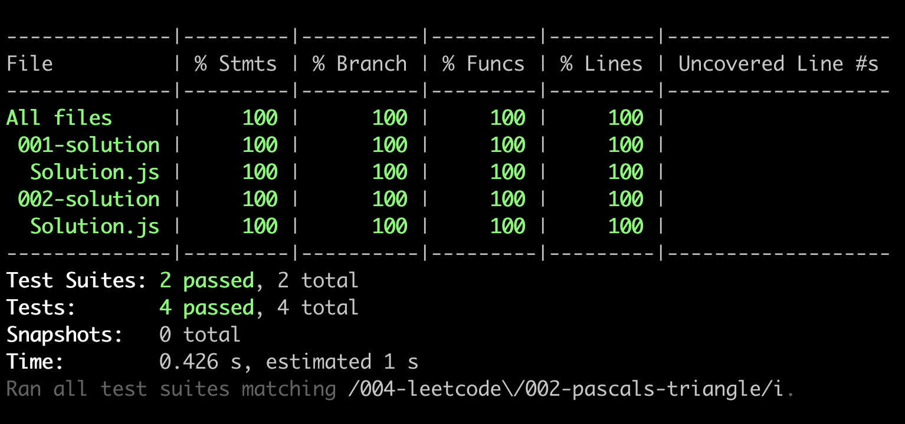

# Pascal's Triangle

<https://leetcode.com/problems/pascals-triangle/>

- [Problem](#problem)
- [Solution](#solution)
  - [Brute Force (+ Combination formula)](#brute-force--combination-formula)
  - [Optimal (+ Combination formula)](#optimal--combination-formula)
- [Test Results](#test-results)

## Problem

## Solution

### Brute Force (+ Combination formula)

### Optimal (+ Combination formula)

### Backtracking (Optimized)

## Test Results

