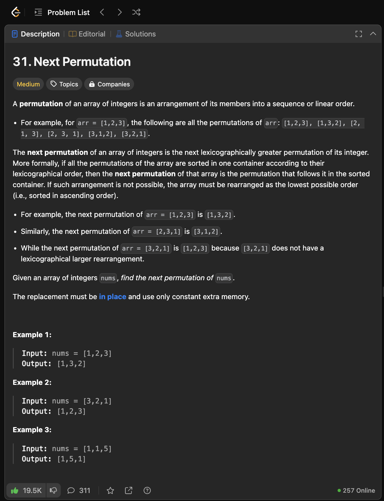
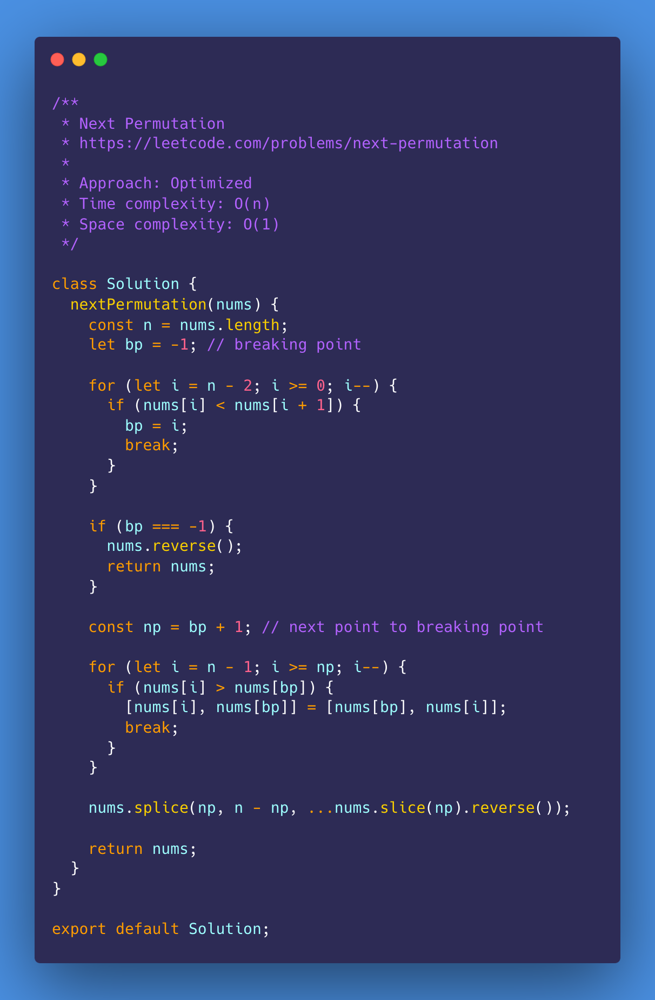
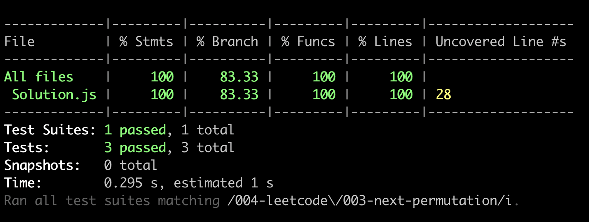

# Next Permutation

<https://leetcode.com/problems/next-permutation/>

- [Problem](#problem)
- [Solution](#solution)
  - [Optimized](#optimized)
- [Test Results](#test-results)

## Problem

## Solution

### Optimized

## Test Results

